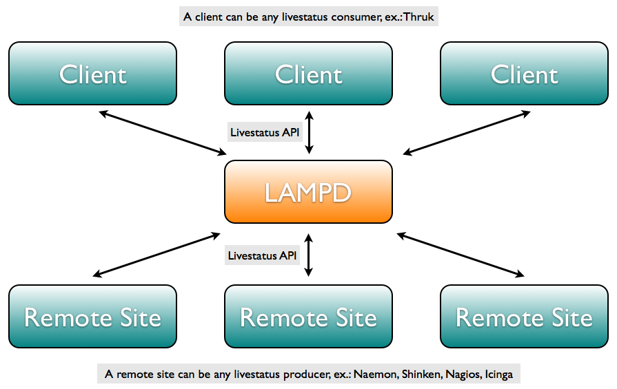

LMD - Livestatus Multitool Daemon
=================================

[](https://github.com/sni/lmd/actions?query=workflow:citest)
[](https://goreportcard.com/report/github.com/sni/lmd)
[](http://www.gnu.org/licenses/gpl-3.0)


What is this
============

LMD fetches Livestatus data from one or multiple sources and provides:

- A combined Livestatus API for those sources.
- A cache which makes Livestatus queries a lot faster than requesting them directly from the remote sources.
- A enhanced Livestatus API with more useful output formats and sorting. See list below.
- Aggregated Livestatus results for multiple backends.
- A Prometheus exporter for Livestatus based metrics for Nagios, Icinga, Shinken and Naemon.

So basically this is a "Livestatus In / Livestatus Out" daemon. Its main purpose is to
provide the backend handling of the [Thruk Monitoring Gui](http://www.thruk.org) in a native
compiled fast daemon, but it should work for everything which requires Livestatus.



Log table requests and commands are just passed through to the actual backends.


Requirements
============

You will need

 - Go >= 1.19

to compile lmd.


How does it work
================

After starting LMD, it fetches all tables via Livestatus API from all
configured remote backends. It then polls periodically all dynamic parts of the
objects, like host status, plugin output or downtime status.

When there are no incoming connections to LMD, it switches into the idle mode
with a slower poll interval. As soon as the first client requests some data,
LMD will do a spin up and run a synchronous update (with small timeout) and
change back to the normal poll interval.


Usage
=====

If you want to use LMD with Thruk within OMD, see the [omd/lmd
page](https://labs.consol.de/omd/packages/lmd/) for a quick start. The
[OMD-Labs Edition](https://labs.consol.de/omd/) is already prepared to use LMD.


Installation
============

```
    %> go install github.com/sni/lmd/v2/lmd@latest
```

or

```
    %> git clone https://github.com/sni/lmd
    %> cd lmd
    %> make
```


Quick start with command line parameters:
```
    lmd -o listen=:3333 -o connection=test,remote_host:6557
```

Or copy lmd.ini.example to lmd.ini and change to your needs. Then run lmd.
You can specify the path to your config file with `--config`.

```
    lmd --config=/etc/lmd/lmd.ini
```

Configuration
=============

The configuration is explained in the `lmd.ini.example` in detail.
There are several different connection types.

### TCP Livestatus  ###

Remote Livestatus connections via tcp can be defined as:

```
    [[Connections]]
    name   = "Monitoring Site A"
    id     = "id1"
    source = ["192.168.33.10:6557"]
```

If the source is a cluster, you can specify multiple addresses like
```
    source = ["192.168.33.10:6557", "192.168.33.20:6557"]
```

### Unix Socket Livestatus  ###

Local unix sockets Livestatus connections can be defined as:

```
    [[Connections]]
    name   = "Monitoring Site A"
    id     = "id1"
    source = ["/var/tmp/nagios/live.sock"]
```


Cluster Mode
============
It is possible to operate LMD in a cluster mode which means multiple LMDs connect to a network and share the resources.
All backend connections will be split up and divided upon all cluster nodes. Incoming requests will be forwared and merged.

In order to setup cluster operations, you need to add a http(s) listener and a list of nodes.
All nodes should share the same configuration file.

```
Listen  = ["/var/tmp/lmd.sock", "http://*:8080"]
Nodes   = ["http://10.0.0.1:8080", "http://10.0.0.2:8080"]
```


What is different in LMD
========================

There are some new/changed Livestatus query headers:

### Output Format ###

The default OutputFormat is `wrapped_json` but `json` is also supported.

The `wrapped_json` format will put the normal `json` result in a hash with
some more extra meta data:

    - columns: the column names (if requested)
    - data: the original result.
    - total_count: the number of matches in the result set _before_ the limit and offset applied.
    - rows_scanned: the number of data rows scanned to produce the result set.
    - failed: a hash of backends which have errored for some reason.

### Response Header ###

The only ResponseHeader supported right now is `fixed16`.

### Backends Header ###

There is a new Backends header which may set a space separated list of
backends. If none specific, all are returned.

ex.:

    Backends: id1 id2


### Offset Header ###

The offset header can be used to only retrieve a subset of the complete result
set. Best used together with the sort header.

    Offset: 100
    Limit: 10

This will return entrys 100-109 from the overal result set.


### Sort Header ###

The sort header can be used to sort the results by one or more columns.
Multiple sort header can be used.

    Sort: <column name> <asc/desc>

Sorting by custom variables is possible like this:

    Sort: custom_variables <name> <asc/desc>

ex.:

    GET hosts
    Sort: state asc
    Sort: name desc
    Sort: custom_variables WORKER asc


### Additional Columns ###

  - peer_key: id of the backend where this object belongs too (all tables)
  - peer_name: name of the backend where this object belongs too (all tables)
  - has_long_plugin_output: flag if there is long_plugin_output or not (hosts/services table)

### Additional Tables ###

  - sites: list of connected backends

Resource Usage
==============
The improved performance comes at a price of course. The following numbers
should give you a rough idea on what to expect: An example installation with
200.000 services at a 3 second update interval uses around 1.5gB of memory and
200kByte/s of bandwith.  This makes an average of 7kB memory and 1Byte/s of
bandwitdh usage per service.

However your milage may vary, these number heavily depend on the size of the
plugin output and the check interval of your services.  Use the Prometheus
exporter to create nice graphs to see how your environment differs.

Btw, changing the update interval to 30 seconds does not reduce the used
bandwith, you just have to update many services every 30 seconds than small
packages every 3 seconds.


Debugging
=========

LMD can be started with a golang tcp debug profiler:
```
lmd -config lmd.ini -debug-profiler localhost:6060
```

You can then fetch memory heap profile with:
```
curl http://localhost:6060/debug/pprof/heap --output heap.tar.gz
```
or directly run the profiler from go:
```
go tool pprof -web http://localhost:6060/debug/pprof/heap
```

Accordingly cpu profile can be created by:
```
curl http://localhost:6060/debug/pprof/profile --output cpu.tar.gz
```

Those profiles can then be further processed by gos pprof tool:
```
go tool pprof cpu.tar.gz
```


Ideas
=====

Some ideas may or may not be implemented in the future

- Add transparent and half-transparent mode which just handles the map/reduce without cache.
  This is implemented for log table and commands anyway already. Just requires an additional header.
- Cache last 24h of logfiles to speed up most logfile requests
- Fix updating comments (takes too long after sending commands)
